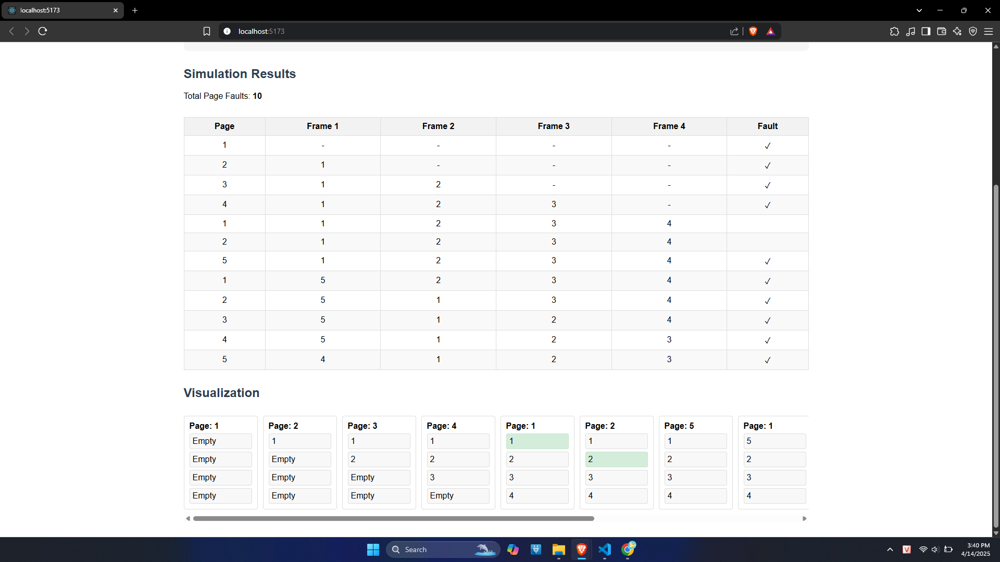
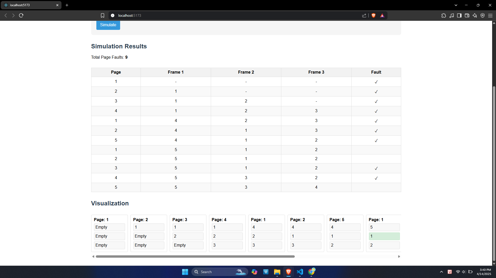

# 🔄 Page Replacement Algorithm Simulator (React + Vite)

Dự án mô phỏng các thuật toán thay thế trang trong hệ điều hành, hiện tại hỗ trợ **Second Chance (Clock Algorithm)**. Người dùng có thể nhập thủ công chuỗi tham chiếu trang và số lượng khung (frames), sau đó hệ thống sẽ hiển thị trực quan các lần xảy ra page fault cùng trạng thái bộ nhớ theo từng bước.

## 🚀 Demo

> Nhập chuỗi trang và số lượng frame

---

> Kết quả mô phỏng thuật toán Second Chance: hiển thị chi tiết từng bước và tổng số page faults

---
### 📸 Trường hợp xảy ra hiện tượng Belady

| 3 Frames | 4 Frames |
|----------|----------|
|  |  |

> 🔍 Với 3 frame (trái), số lần page fault là **9**.  
> Với 4 frame (phải), số lần page fault lại tăng thành **10** – minh họa cho **hiện tượng Belady**.

---

## 🧠 Tính năng chính

- ✅ Nhập chuỗi tham chiếu trang thủ công
- ✅ Nhập số lượng khung trang (frame)
- ✅ Chọn thuật toán thay thế trang (hiện tại là **Second Chance**)
- ✅ Hiển thị trạng thái bộ nhớ và lỗi trang từng bước

---

## 🛠️ Công nghệ sử dụng

- ⚡ **Vite** – bundler siêu nhanh cho React
- ⚛️ **React** – thư viện xây dựng giao diện người dùng

---
